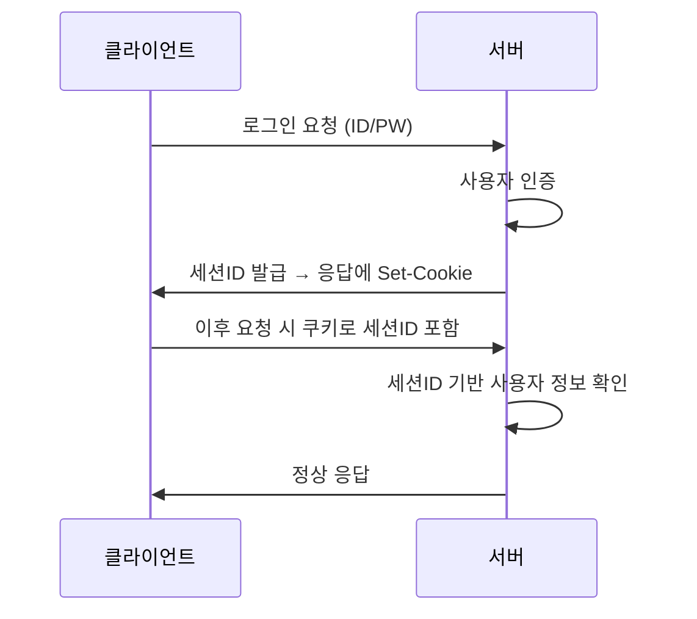
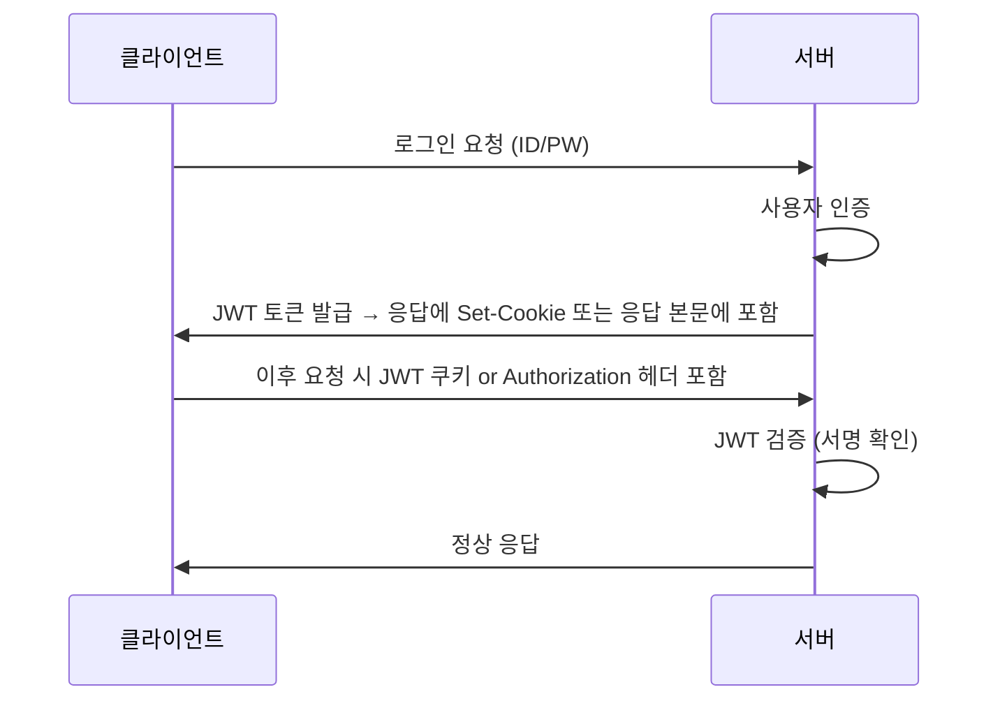

# 🛡️ 세션(Session)과 쿠키(Cookie) 기반 인증 흐름 정리

## 1. 인증과 상태 유지란?

웹은 기본적으로 **무상태(Stateless)** 프로토콜이므로 사용자의 로그인 상태를 자동으로 기억하지 않음.  
이를 해결하기 위해 **상태 유지 전략**으로 `세션` 또는 `쿠키`를 사용.

---

## 2. 상태 유지 전략 비교: Session vs Cookie

| 항목             | 세션(Session)                                         | 쿠키(Cookie)                                         |
|------------------|-------------------------------------------------------|------------------------------------------------------|
| 저장 위치        | 서버 메모리 (혹은 DB/Redis 등)                        | 클라이언트 브라우저                                 |
| 보안성           | 상대적으로 안전 (클라이언트에 민감 정보 미저장)       | 보안에 취약 (노출될 가능성 있음)                   |
| 만료 시간        | 서버에서 설정 가능 (세션 유지 시간)                   | 클라이언트가 설정하거나 서버가 지정                |
| 저장 용량 제한   | 제한 없음 (서버 자원 의존)                            | 약 4KB 제한                                          |
| 클라이언트 제어  | 클라이언트는 세션ID만 가지고 있음                     | 클라이언트가 모든 데이터를 보유 및 전송            |
| 사용 예시        | 로그인 상태 유지, 장바구니 등                         | 자동 로그인, 방문기록, UI 상태 유지 등              |

---

## 3. 세션 기반 인증 흐름



- **세션ID**는 주로 쿠키(`Set-Cookie: sessionID=abc123`)로 클라이언트에 저장
- 서버는 `sessionID`를 메모리/Redis/DB에서 사용자 정보와 매핑하여 인증 확인

---

## 4. 쿠키 기반 인증 흐름 (JWT 예시)



- JWT는 **서버 상태를 저장하지 않음(Stateless)**
- 사용자는 토큰을 요청마다 전달
- 서버는 토큰의 유효성만 확인 (서버에 세션 저장 안 함)

---

## 5. 로그인 구조 적용 예시 (세션 기반)

### ✅ 서버 코드 예시 (Node.js Express)

```ts
import session from 'express-session';
app.use(session({
  secret: 'secret-key',
  resave: false,
  saveUninitialized: true
}));

app.post('/login', (req, res) => {
  const {id, password} = req.body;
  // 인증 로직
  req.session.user = { id }; // 세션에 사용자 정보 저장
  res.send('로그인 성공');
});

app.get('/profile', (req, res) => {
  if (req.session.user) {
    res.send(`환영합니다 ${req.session.user.id}`);
  } else {
    res.status(401).send('로그인이 필요합니다');
  }
});
```

---

## 6. 보안 팁

- HTTPS 환경에서만 쿠키 전송 (`secure`, `httpOnly` 옵션 설정)
- CSRF 방지: SameSite 설정 또는 토큰 방식 사용
- 세션 스토어: 메모리보다는 Redis나 DB 권장 (서버 재시작 시 유지)

---

## ✅ 요약

| 구분     | 세션 기반                       | 쿠키 기반(JWT 등)                |
|----------|----------------------------------|----------------------------------|
| 장점     | 서버에서 관리 → 보안 우수         | 서버 상태 필요 없음 → 확장성 우수 |
| 단점     | 서버 메모리 사용                | 토큰 탈취 시 위험                 |
| 주 용도  | 내부 서비스, 관리 시스템 등      | API, SPA 프론트와의 통신 등      |
